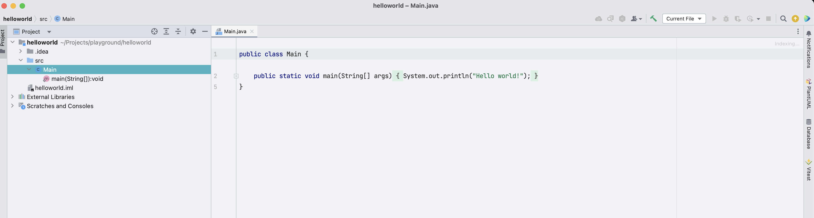
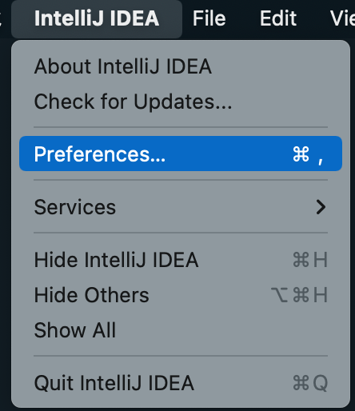
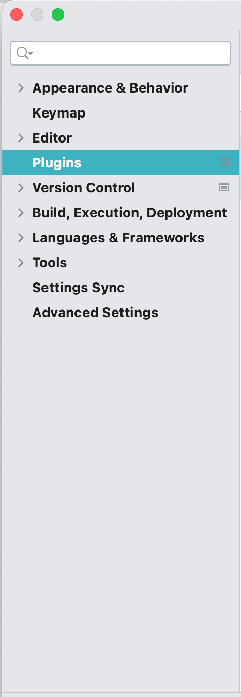
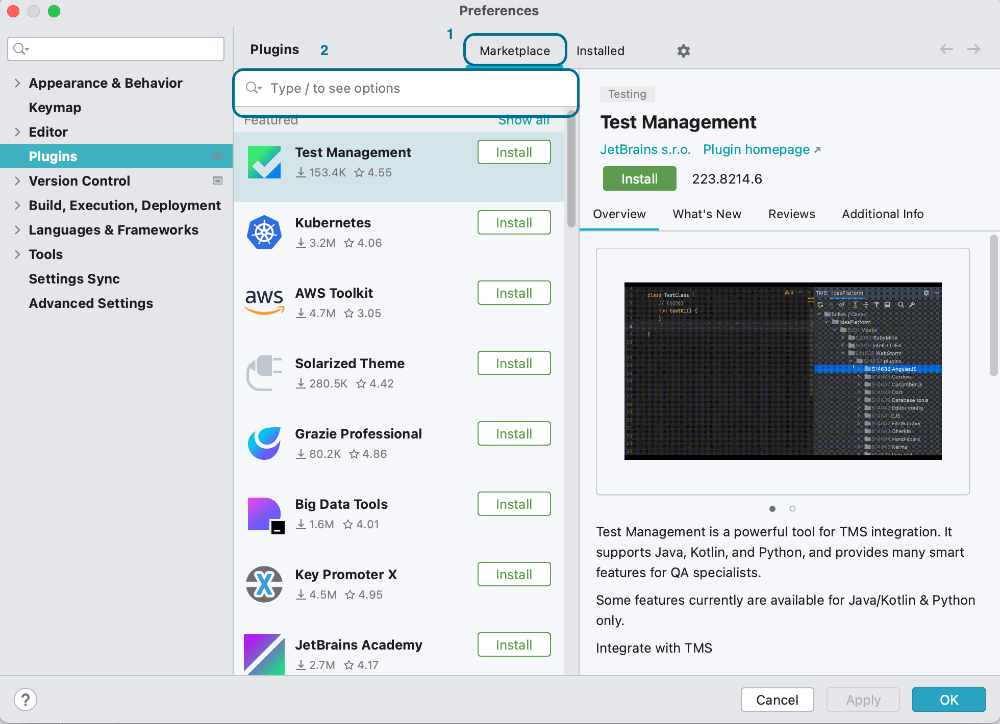

# Getting Started with Jetbrains IntelliJ IDEA

## What is Jetbrains IntelliJ IDEA?

IntelliJ IDEA, or IntelliJ, is a integrated development environment used primarily for Java/Kotlin application development. It provides developers with functionalities such as creating and managing Java projects, code suggestion and completions, code refactoring, source control via Git, and many others.

## Creating a new Java project on the Mac

The following tutorial guides you on how to create a new Java project from within IntelliJ running on the Mac. 

### Prerequisites

1. The latest Java development kit should be installed on your local machine.

### Steps

1. Click **File** on the menubar
2. Select **New >** on the popup menu with your mouse
3. Click **Project...**

4. In the popup dialog, enter a name for your project in **Name** field. In this example, we use "helloworld"
5. Choose a new location for your project by clicking on the icon in **Location** field if you do not want the default option.
6. Leave the rest of the settings as default.

7. Click **Create** button. 

### Expected Result

IntelliJ will create the project with a sample helloworld application.

## Install Plugins for IntelliJ on the Mac

Plugins are add-ons that can improve your productivity and development experience when using IntelliJ to develop your applications.

### Prerequisities

1. IntelliJ is installed and configured to run. 
2. You are not in the middle of writing codes.

### Steps

1. Click on **IntelliJ IDEA** on the menubar
2. Click on **Preferences...** to open the **Preferences** window

3. Click on **Plugins** on the left side.

4. Select Marketplace (1) if it is not. Then, in the textfield (2), enter the name of the plugin you want. The name can be partial or in full. 

5. After the plugin has been found, install it by clicking on the **Install** button to start the installation process. IntelliJ may prompt you to restart.
6. Restart IntelliJ to begin using the plugin on the next startup.

